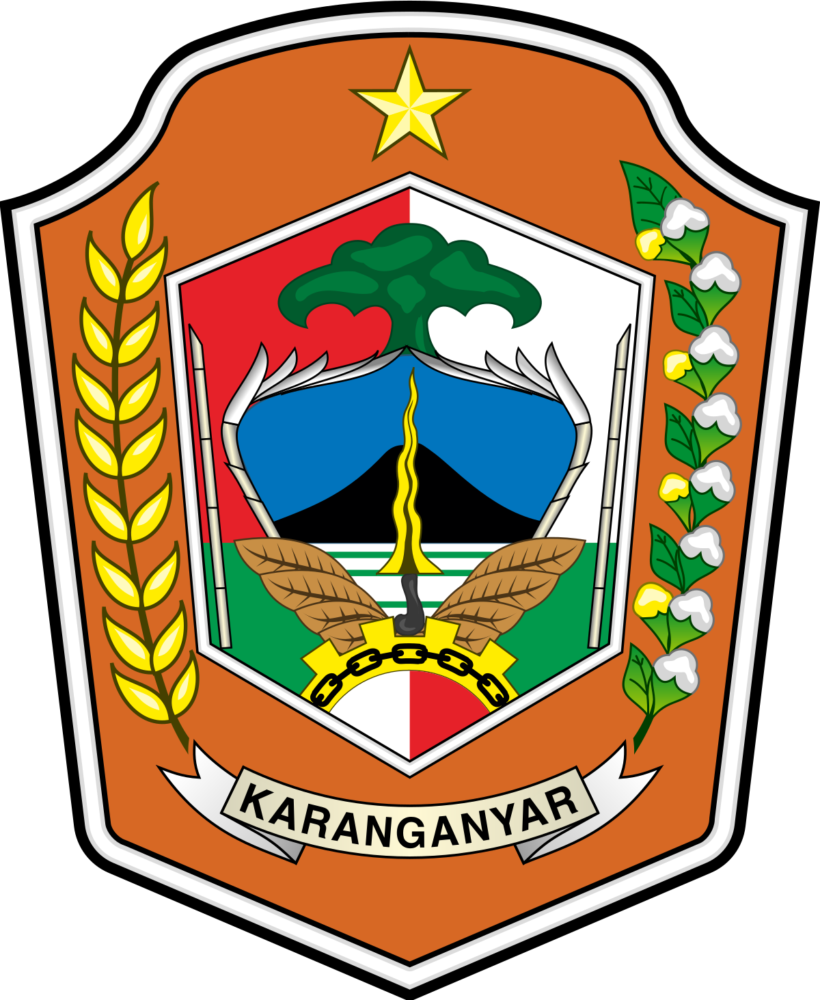
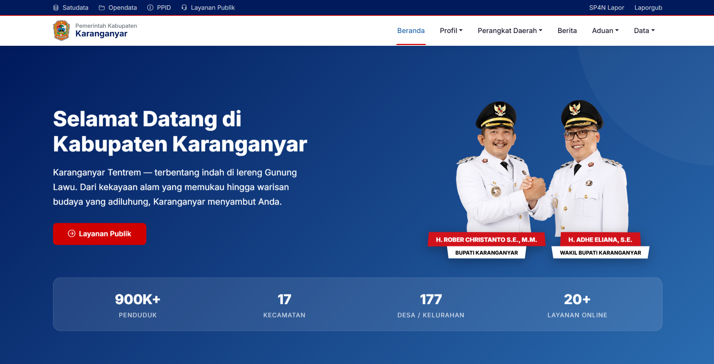
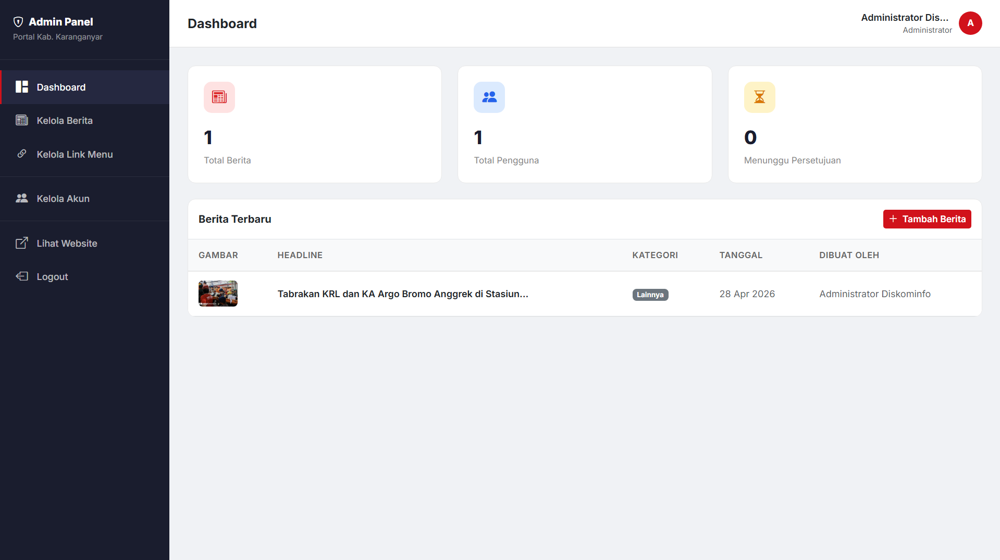

<div align="center">



# Portal Resmi Pemerintah Kabupaten Karanganyar

**Platform informasi & layanan publik digital Kabupaten Karanganyar**


</div>

---

## Daftar Isi

- [Tentang Proyek](#️-tentang-proyek)
- [Screenshot Tampilan Aplikasi](#-screenshot-tampilan-aplikasi)
- [Fitur Utama](#-fitur-utama)
- [Teknologi yang Digunakan](#️-teknologi-yang-digunakan)
- [Persyaratan Sistem](#-persyaratan-sistem)
- [Cara Instalasi & Menjalankan](#-cara-instalasi--menjalankan-local-development)
- [Akun Akses Default](#-akun-akses-default-testing)
- [Struktur Direktori](#-struktur-direktori-penting)
- [Daftar Route Aplikasi](#️-daftar-route-aplikasi)
- [Skema Database](#️-skema-database)
- [Arsitektur Keamanan](#-arsitektur-keamanan)

---

## Tentang Proyek

**Portal Resmi Pemerintah Kabupaten Karanganyar** adalah aplikasi web berbasis **Laravel 10** yang dikembangkan sebagai pusat informasi, berita, dan layanan publik digital untuk warga Kabupaten Karanganyar, Jawa Tengah.

Proyek ini dibangun selama program **Magang MSIB di Dinas Komunikasi dan Informatika (Diskominfo)** dan dirancang dengan dua lapisan utama:

| Lapisan | Keterangan |
|---|---|
| **Frontend (Publik)** | Halaman yang dapat diakses bebas oleh seluruh masyarakat, menampilkan informasi daerah, berita terkini, dan data pemerintah. |
| **Backend (Admin)** | Panel manajemen khusus untuk operator Diskominfo guna mengelola konten, berita, navigasi, dan akun pengguna. |

---

## Screenshot Tampilan Aplikasi

### 1. Tampilan Pengunjung — Beranda (Frontend)

Halaman beranda yang dihadapi oleh seluruh masyarakat sebagai pengunjung. Menampilkan hero section dengan foto Bupati & Wakil Bupati, statistik daerah, serta navigasi menu yang dikelola secara dinamis dari database.



> **Komponen yang terlihat pada gambar di atas:**
> - **Top Bar**: Tautan cepat ke Satudata, Opendata, PPID, Layanan Publik, SP4N Lapor, dan LaporGub — semua URL dinamis dari database.
> - **Navbar Utama**: Logo Pemkab, menu Beranda, Profil, Perangkat Daerah, Berita, Aduan, Data — semua dengan dukungan dropdown dinamis.
> - **Hero Section**: Slogan *"Selamat Datang di Kabupaten Karanganyar"*, foto Bupati **H. Rober Christanto, S.E., M.M.** dan Wakil Bupati **H. Adhe Eliana, S.E.**, dengan name tag yang dapat diatur posisi dan ukurannya secara independen.
> - **Statistik Daerah**: 900K+ Penduduk, 17 Kecamatan, 177 Desa/Kelurahan, 20+ Layanan Online.

---

### 2. Tampilan Dashboard Admin (Backend)

Panel administrasi khusus operator Diskominfo. Menyediakan statistik ringkas, manajemen berita, manajemen link navigasi, dan persetujuan akun editor.



> **Komponen yang terlihat pada gambar di atas:**
> - **Sidebar Navigasi**: Dashboard, Kelola Berita, Kelola Link Menu, Kelola Akun, Lihat Website, Logout.
> - **Kartu Statistik**: Total Berita, Total Pengguna, dan Jumlah Akun Menunggu Persetujuan.
> - **Tabel Berita Terbaru**: Pratinjau thumbnail OG Image, judul headline, kategori (badge), tanggal publikasi, dan nama operator pembuat.
> - **Tombol Tambah Berita**: Akses cepat ke form penambahan berita baru.

---

## Fitur Utama

### Frontend (Halaman Publik)

| Fitur | Deskripsi |
|---|---|
| **Desain Modern & Responsif** | Antarmuka elegan menggunakan Bootstrap 5.3 & Vanilla CSS, dioptimalkan untuk Desktop, Tablet, dan Mobile. |
| **Hero Section Dinamis** | Menampilkan foto kepala daerah dengan name tag Bupati & Wakil Bupati yang posisi serta ukurannya dapat diatur secara independen melalui CSS. |
| **Statistik Daerah** | Kartu statistik animatif: jumlah penduduk, kecamatan, desa/kelurahan, dan layanan online. |
| **Berita Real-time (OG Image Scraper)** | Berita yang ditampilkan di halaman publik langsung mengambil data dari database yang dikelola admin. Thumbnail diambil otomatis via PHP cURL dengan parsing meta tag `og:image`. |
| **Navigasi & Link 100% Dinamis** | Seluruh link di halaman publik (Top Bar, Akses Cepat, Perangkat Daerah, Potensi, dan Aduan) langsung terhubung ke tabel `menu_links` di database. Setiap perubahan di admin langsung tercermin di frontend tanpa perlu edit kode. |
| **GPR Widget Kominfo** | Terintegrasi dengan widget Government Public Relations (GPR) resmi Kominfo Pusat di bagian footer. |
| **No-Cache di Semua Halaman** | Header `Cache-Control: no-store` diterapkan juga pada route publik, sehingga browser selalu mengambil data terbaru dari server dan tidak menampilkan link lama dari cache. |

### Backend (Dashboard Admin)

| Fitur | Deskripsi |
|---|---|
| **Autentikasi Berlapis** | Sistem login khusus admin dengan proteksi No-Cache Headers untuk mencegah bypass via tombol *Back* browser. |
| **Manajemen Berita (CRUD)** | Tambah, edit, dan hapus berita. Thumbnail diambil otomatis dari URL sumber. Mendukung refresh manual gambar OG. |
| **Kelola Link Menu (MenuLinks)** | Edit URL untuk setiap item navigasi di halaman publik (Top Bar, Akses Cepat, Perangkat Daerah, Potensi, Aduan) secara real-time dari dashboard. Perubahan langsung muncul di website tanpa deploy ulang. |
| **Manajemen Pengguna** | Registrasi bertahap: akun Editor baru **wajib disetujui** oleh Administrator sebelum dapat login. Admin dapat menyetujui, menolak, atau menghapus akun. |
| **Sistem Role** | Dua level akses: `Administrator` (akses penuh) dan `Editor` (akses terbatas). |
| **Dashboard Ringkasan** | Tampilan statistik total berita, total pengguna, dan daftar akun menunggu persetujuan secara *real-time*. |
| **Penanganan Sesi Expired (419)** | Jika sesi admin habis (CSRF token expired), sistem otomatis mengarahkan kembali ke halaman login dengan pesan notifikasi, bukan menampilkan halaman error 419. |

---

## Teknologi yang Digunakan

| Kategori | Teknologi | Versi |
|---|---|---|
| **Backend Framework** | Laravel | 10.x |
| **Bahasa Pemrograman** | PHP | ^8.1 |
| **Database** | MySQL | 8.x |
| **Frontend CSS** | Bootstrap | 5.3 |
| **Frontend Styling** | Vanilla CSS | — |
| **HTTP Client** | PHP cURL (built-in) | — |
| **Package Manager** | Composer | 2.x |
| **Build Tool** | Vite | — |
| **Dev Environment** | Laragon | — |
| **Arsitektur** | MVC (Model-View-Controller) | — |

---

## Persyaratan Sistem

Pastikan sistem Anda memenuhi persyaratan berikut sebelum instalasi:

- **PHP** >= 8.1 (dengan ekstensi: `curl`, `mbstring`, `openssl`, `pdo`, `pdo_mysql`, `tokenizer`, `xml`)
- **Composer** >= 2.x
- **MySQL** >= 5.7 / MariaDB >= 10.3
- **Node.js** >= 18.x & **npm** >= 9.x
- **Web Server**: Laragon (direkomendasikan) / XAMPP / Apache / Nginx

---

## Cara Instalasi & Menjalankan (Local Development)

Ikuti langkah-langkah berikut secara berurutan untuk menjalankan project di komputer Anda:

### Langkah 1 — Clone Repository

```bash
git clone https://github.com/mezuuu/Pemerintah-Kabupaten-Karanganyar.git
cd Pemerintah-Kabupaten-Karanganyar
```

### Langkah 2 — Install Dependensi PHP (Composer)

```bash
composer install
```

### Langkah 3 — Install Dependensi Node.js

```bash
npm install
```

### Langkah 4 — Konfigurasi Environment (`.env`)

Duplikat file konfigurasi:

```bash
cp .env.example .env
```

Buka file `.env` dan sesuaikan nilai berikut (pastikan MySQL di Laragon sudah aktif):

```env
APP_NAME="Portal Karanganyar"
APP_URL=http://localhost:8000

DB_CONNECTION=mysql
DB_HOST=127.0.0.1
DB_PORT=3306
DB_DATABASE=portal_karanganyar
DB_USERNAME=root
DB_PASSWORD=

SESSION_LIFETIME=10
SESSION_DRIVER=file
```

> `SESSION_LIFETIME=10` mengatur sesi admin akan berakhir setelah **10 menit tidak aktif**, demi keamanan.

### Langkah 5 — Generate Application Key

```bash
php artisan key:generate
```

### Langkah 6 — Buat Database

Buka phpMyAdmin (atau MySQL client lainnya) dan buat database baru:

```sql
CREATE DATABASE portal_karanganyar CHARACTER SET utf8mb4 COLLATE utf8mb4_unicode_ci;
```

### Langkah 7 — Jalankan Migrasi & Seeder Database

Perintah ini akan membuat semua tabel dan mengisi data awal (akun admin utama + link menu navigasi default):

```bash
php artisan migrate --seed
```

### Langkah 8 — Jalankan Server Lokal

```bash
php artisan serve
```

Aplikasi dapat diakses di: **`http://localhost:8000`**

Untuk akses jaringan lokal (LAN):

```bash
php artisan serve --host 0.0.0.0 --port 8000
```

---

## Akun Akses Default (Testing)

Setelah database selesai di-*seed*, gunakan kredensial berikut untuk masuk ke Dashboard Admin:

| Field | Nilai |
|---|---|
| **URL Login** | `http://localhost:8000/admin/login` |
| **Username** | `DiskominfoKeren` |
| **Password** | `DiskominfoKaranganyarKeren` |
| **Role** | Administrator |

> **Penting:** Segera ganti password default ini pada lingkungan produksi melalui menu **Kelola Akun** di Dashboard Admin.

---

## Struktur Direktori Penting

```text
Pemerintah-Kabupaten-Karanganyar/
│
├── app/
│   ├── Exceptions/
│   │   └── Handler.php                 ← Penanganan error global (termasuk 419 Session Expired)
│   ├── Http/
│   │   ├── Controllers/
│   │   │   ├── Admin/                  ← Logika Panel Admin
│   │   │   │   ├── DashboardController.php
│   │   │   │   ├── NewsController.php      (CRUD Berita + OG Image Scraper)
│   │   │   │   ├── UserController.php      (Kelola & Approve Akun)
│   │   │   │   └── MenuLinkController.php  (Kelola Link Navbar & Halaman Publik)
│   │   │   ├── Auth/
│   │   │   │   └── LoginController.php     (Login, Logout, Registrasi)
│   │   │   └── Frontend/
│   │   │       └── HomeController.php      (Beranda, Berita, Layanan Publik)
│   │   └── Middleware/
│   │       ├── AdminApproved.php           (Cek status approval akun)
│   │       └── NoCacheHeaders.php          (Prevent browser cache — diterapkan ke semua route)
│   └── Models/
│       ├── MenuLink.php                ← Model untuk semua link dinamis halaman publik
│       ├── News.php
│       └── User.php
│
├── database/
│   ├── migrations/                     ← Definisi skema tabel
│   ├── seeders/
│   │   ├── AdminSeeder.php             (Seed akun admin default)
│   │   ├── MenuLinkSeeder.php          (Seed link navigasi & halaman publik default)
│   │   └── DatabaseSeeder.php
│   └── portal_karanganyar.sql          ← Dump SQL cadangan database
│
├── resources/
│   └── views/
│       ├── admin/                      ← Template Blade panel admin
│       │   ├── login.blade.php             (Form login + tampilan pesan sesi expired)
│       │   └── menu-links/index.blade.php  (Halaman kelola link menu)
│       └── frontend/                   ← Template Blade halaman publik
│           ├── home.blade.php              (Semua link menggunakan MenuLink::where() dinamis)
│           └── layouts/app.blade.php       (Top bar menggunakan link dinamis dari database)
│
├── routes/
│   └── web.php                         ← Semua route (publik + admin), publik pakai NoCacheHeaders
│
├── public/
│   ├── css/app.css                     ← Custom styling CSS (termasuk hero name tag Bupati & Wakil)
│   └── images/                         ← Aset gambar statis (logo, header, dll.)
│
└── docs/
    └── screenshots/                    ← Dokumentasi screenshot aplikasi
        ├── home-desktop.png
        └── admin-dashboard.png
```

---

## Daftar Route Aplikasi

### Route Publik (Frontend) — dengan `NoCacheHeaders`

| Method | URL | Nama Route | Keterangan |
|---|---|---|---|
| `GET` | `/` | `home` | Halaman Beranda Utama |
| `GET` | `/profil` | `profil` | Profil Kabupaten Karanganyar |
| `GET` | `/legislatif` | `legislatif` | Informasi Legislatif |
| `GET` | `/pejabat` | `pejabat` | Daftar Pejabat Daerah |
| `GET` | `/rlppd` | `rlppd` | Ringkasan Laporan Penyelenggaraan Pemda |
| `GET` | `/organisasi/{slug}` | `organisasi` | Halaman Perangkat Daerah |
| `GET` | `/berita` | `berita` | Daftar Berita Daerah |
| `GET` | `/layanan-publik` | `layanan-publik` | Direktori Layanan Publik |
| `GET` | `/wbs` | `wbs` | Whistleblowing System |
| `GET` | `/suara-masyarakat` | `suara-masyarakat` | Form Aduan Masyarakat |
| `GET` | `/transparansi-anggaran` | `transparansi-anggaran` | Data Transparansi Anggaran |
| `GET` | `/hibah-dan-bansos` | `hibah-bansos` | Data Hibah & Bantuan Sosial |
| `GET` | `/statistik` | `statistik` | Statistik Daerah |

### Route Admin (Dilindungi Autentikasi)

| Method | URL | Nama Route | Keterangan |
|---|---|---|---|
| `GET` | `/admin/login` | `admin.login` | Form Login Admin |
| `POST` | `/admin/login` | `admin.login.submit` | Proses Login |
| `POST` | `/admin/logout` | `admin.logout` | Proses Logout |
| `POST` | `/admin/register` | `admin.register` | Registrasi Akun Editor |
| `GET` | `/admin` | `admin.dashboard` | Dashboard Utama |
| `GET/POST` | `/admin/news` | `admin.news.*` | Manajemen Berita (CRUD) |
| `GET/PUT/DELETE` | `/admin/users` | `admin.users.*` | Manajemen Pengguna |
| `GET/POST/PUT/DELETE` | `/admin/menu-links` | `admin.menu-links.*` | Manajemen Link Seluruh Halaman Publik |

---

## Skema Database

### Tabel `users`

| Kolom | Tipe | Keterangan |
|---|---|---|
| `id` | BIGINT (PK) | Primary key |
| `name` | VARCHAR(255) | Nama lengkap pengguna |
| `username` | VARCHAR(255) | Username unik untuk login |
| `password` | VARCHAR(255) | Password terenkripsi (bcrypt) |
| `role` | ENUM | `administrator` / `editor` |
| `is_approved` | BOOLEAN | Status persetujuan akun (default: `false`) |
| `created_at` | TIMESTAMP | Waktu pendaftaran |

### Tabel `news`

| Kolom | Tipe | Keterangan |
|---|---|---|
| `id` | BIGINT (PK) | Primary key |
| `headline` | VARCHAR(255) | Judul berita |
| `description` | TEXT | Ringkasan isi berita |
| `link` | TEXT | URL sumber berita asli (dapat diklik di frontend) |
| `og_image` | TEXT | URL gambar thumbnail (hasil scraping OG) |
| `category` | VARCHAR(50) | Kategori berita |
| `created_by` | BIGINT (FK) | ID pengguna pembuat |
| `created_at` | TIMESTAMP | Waktu publikasi |

### Tabel `menu_links`

| Kolom | Tipe | Keterangan |
|---|---|---|
| `id` | BIGINT (PK) | Primary key |
| `group` | VARCHAR(100) | Kategori link (misal: `Aduan`, `Perangkat Daerah`, `Data`) |
| `label` | VARCHAR(255) | Nama/teks link yang dicocokkan di frontend |
| `url` | TEXT | URL tujuan link (internal atau eksternal) |
| `is_external` | BOOLEAN | Apakah link dibuka di tab baru |
| `order` | INTEGER | Urutan tampil dalam grupnya |
| `created_at` | TIMESTAMP | Waktu dibuat |

> **Catatan:** Kolom `label` digunakan sebagai kunci pencarian di frontend. Contoh: `MenuLink::where('label', 'Statistik')->value('url')`. Pastikan label di database dan di kode view selalu konsisten.

---

## Arsitektur Keamanan

Sistem ini menerapkan beberapa lapisan keamanan:

### 1. `NoCacheHeaders` Middleware
Menambahkan HTTP header `Cache-Control: no-cache, no-store, must-revalidate` pada **seluruh route** (admin maupun publik). Ini memastikan browser selalu mengambil data terbaru dari server — mencegah halaman lama (dengan link yang sudah diubah admin) tampil dari cache browser.

### 2. `AdminApproved` Middleware
Memverifikasi bahwa akun yang sedang login memiliki status `is_approved = true`. Jika akun baru terdaftar (Editor belum disetujui), middleware ini memblokir akses ke dashboard dan menampilkan pesan informasi.

### 3. CSRF Protection & Penanganan 419
Semua form yang melakukan operasi `POST`, `PUT`, dan `DELETE` dilindungi dengan token CSRF bawaan Laravel (`@csrf`). Jika sesi admin habis dan token expired, `Handler.php` secara otomatis menangkap `TokenMismatchException` dan mengarahkan kembali ke halaman login dengan pesan **"Sesi telah berakhir. Silakan coba lagi."** — bukan menampilkan error 419 yang membingungkan.

### 4. Session Security
Session admin dikonfigurasi dengan `SESSION_LIFETIME=10` (10 menit inaktivitas = otomatis logout) untuk meminimalisir risiko jika komputer admin ditinggal tanpa dikunci.

---

## Kontributor

Proyek ini dikembangkan sebagai bagian dari program **Magang MSIB di Dinas Komunikasi dan Informatika (Diskominfo) Kabupaten Karanganyar**.

---

<div align="center">

*Dikembangkan untuk Pemerintah Kabupaten Karanganyar © 2026.*

**[Kunjungi Website](http://localhost:8000) · [Login Admin](http://localhost:8000/admin/login)**

</div>
